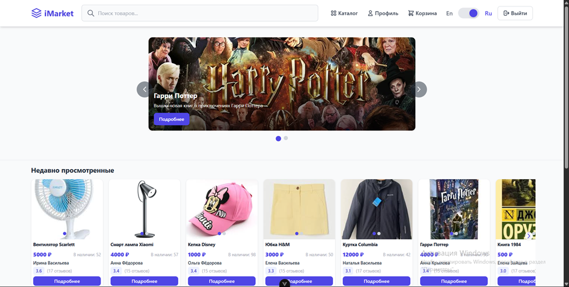
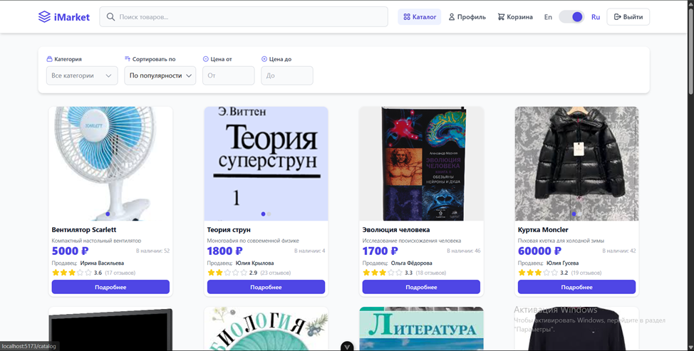
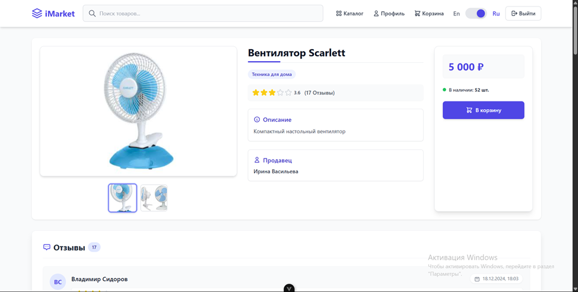
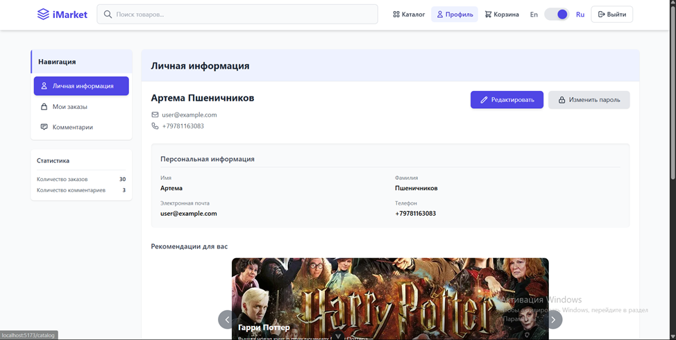
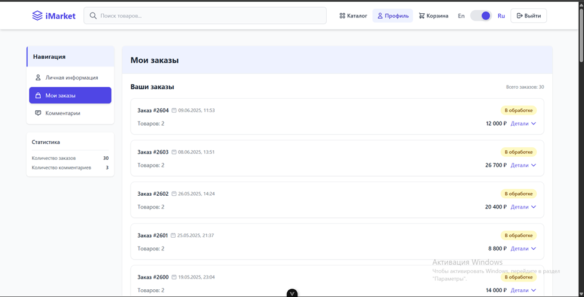
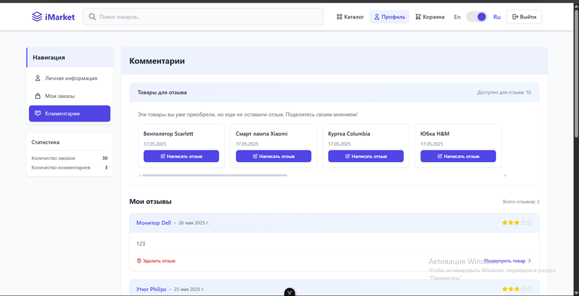
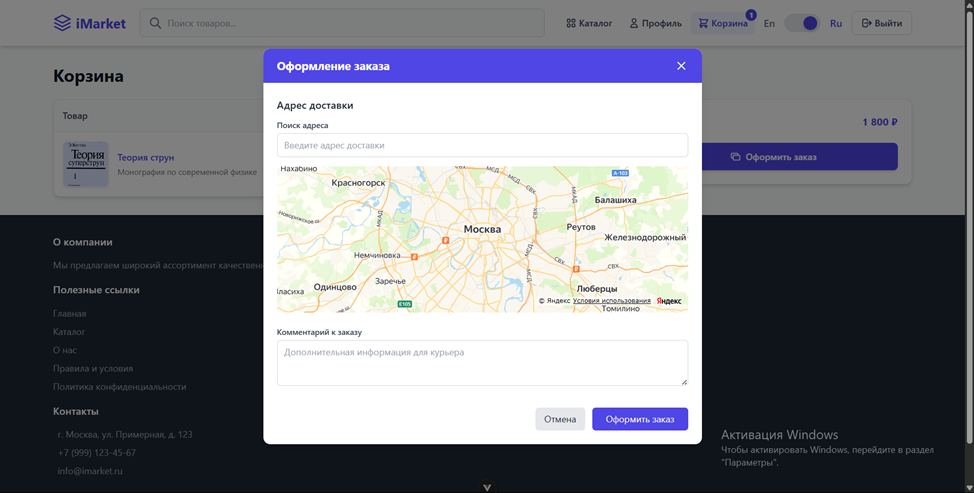
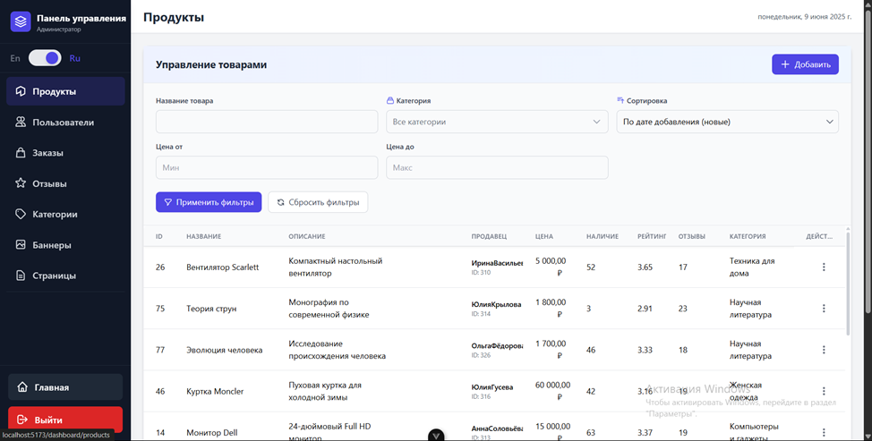
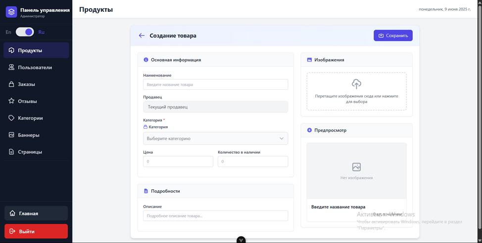
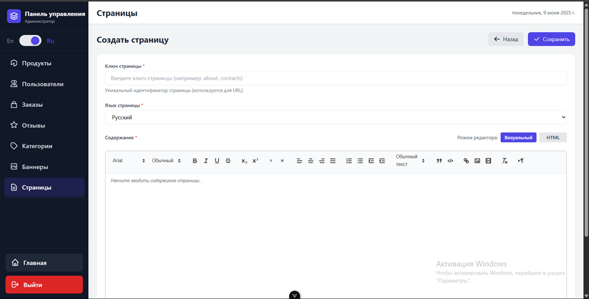

# Marketplace Web Application

## Описание

Веб-приложение маркетплейса, разработанное в рамках курсовой работы. Проект реализует функциональность электронной коммерции: от регистрации и управления товарами до оформления заказов и административного контроля. Все роли пользователей (покупатель, продавец, администратор) имеют строго разграниченные права и интерфейсы.

Проект состоит из клиентской части на Vue 3 и серверной части на ASP.NET Core. Взаимодействие осуществляется через REST API. Для хранения данных используется PostgreSQL. Авторизация реализована с использованием JWT.

## Функциональные возможности

### Общие

- Регистрация и авторизация с выбором роли (покупатель или продавец)
- Защищённая сессия на основе JWT
- Адаптивный пользовательский интерфейс
- Поддержка мультиязычности для статических страниц (русский и английский)

### Покупатель

- Просмотр каталога товаров
- Фильтрация по категории, цене, ключевым словам
- Добавление товаров в корзину
- Оформление заказа (с указанием адреса через Яндекс.Карты)
- Просмотр истории заказов
- Оставление отзывов

### Продавец

- Управление собственными товарами
- Добавление/редактирование/удаление товаров
- Просмотр и обработка заказов
- Получение отзывов на свои товары

### Администратор

- Управление всеми пользователями и товарами
- Управление категориями
- Управление заказами
- Модерация отзывов
- Редактирование статических страниц (через WYSIWYG-редактор Quill)
- Управление баннерами

## Используемые технологии

### Клиентская часть

- Vue 3 (Composition API)
- TypeScript
- Vue Router
- Pinia (хранилище)
- Tailwind CSS
- Quill Editor
- Яндекс.Карты API (для работы с адресами доставки)

### Серверная часть

- ASP.NET Core (C#)
- Entity Framework Core (ORM)
- REST API
- JWT авторизация

### База данных

- PostgreSQL

